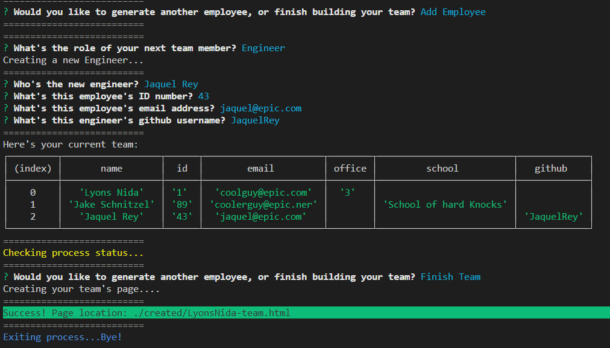

# Team Page Generator  
[](https://www.gnu.org/licenses/lgpl-3.0)  
## Description  
A simple command line app that allows the user to generate a team with a manager, intern(s), and engineer(s). After the user creates their team, a HTML page with Bulma styling is generated to display the team members along with their respective details.  



### [Demo mp4](assets/team-generator-demo.mp4)
  
## Table of Contents  
* [Details](#details)  
       * [Features](#features)  
       * [Technologies](#technologies)  
       * [Dependencies](#dependencies)  
* [Installation](#installation)  
* [Usage](#usage)  
* [Contributing](#contributing)  
* [Tests](#tests)  
* [Questions](#questions)  
* [Credits](#credits)  
----  
## Details  
### Features  
This project features descriptive console logs enhanced with Chalk that aid the user in understanding the process.  
### Technologies  
Node and Inquirer are used for the core functionality, Chalk to improve the user experience, and Jest with Babel for running simple tests on the class constructors. Additionally, Bulma is used to style the generated HTML.  
### Dependencies  
Node, Inquirer, Chalk are required to run the app. Jest + Babel are required to run included tests.  
  
----  
    
## Installation  
Assuming the user has Node installed, they should then clone the repository locally, and navigate to it's root in their terminal. Next, ```npm i``` should be run to install the packages needed to run the app.   
## Usage  
In the terminal at the root of the directory for the app, running the command ```node script.js``` will start the process.  
  
----  
  ## Contributing  
Feel free to fork this repo, or contact me with any suggetions or criticism that I could use to improve the app (or my skills / style)  
## Tests  
Simple class contructor tests are included, written to required specifications. They can be run with the command ```npm test```  
## Questions  
  
>Got questions? Reach out to me at:  
>My [Github](https://github.com/JaquelRey)  
>Email: [JaquelRey@gmail.com](mailto:JaquelRey@gmail.com)  
  
----  
  ## Credits  
### Authors  
This project was a solo venture  
### Resources  
Node docs, and the docs for all dependencies were great to reference. Bulma was wonderful as always for styling the simple HTML. As usual, thanks to StackOverflow, w3schools and MDN. My final thanks goes to my instructor, Ross Ritchey, for helping me understand the last bug that was holding up the completion of the app.  
